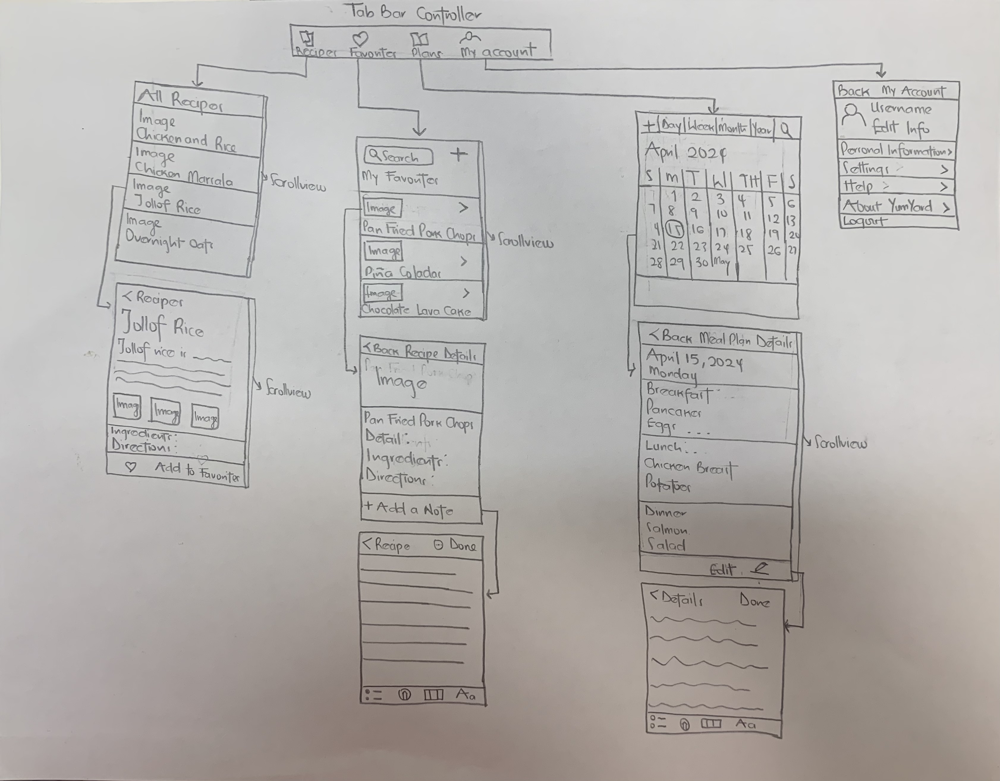

Original App Design Project - README Template
===

# YumYard

## Table of Contents
- [1. Product Spec](#1-product-spec)
  * [1.1 App Overview](#11-app-overview)
  * [1.1.1 Description](#111-description)
  * [1.1.2 App Evaluation](#112-app-evaluation)
  * [1.2 App Spec](#12-app-spec)
  * [1.2.1. User Features (Required and Optional)](#121-user-features)
  * [1.2.2. Screen Archetypes](#122-screen-archetypes)
  * [1.2.3. Navigation Flow](#123-navigation-flow)
- [2. Wireframes](#2-wireframes)
  * [[BONUS] Digital Wireframes & Mockups](#-bonus--digital-wireframes---mockups)
  * [[BONUS] Interactive Prototype](#-bonus--interactive-prototype)
- [3. Schema](#3-schema)
  * [Models](#models)
  * [Networking](#networking)

## 1. Product-Spec
### 1.1 App-Overview

### 1.1.1 Description

YumYard is an app designed to help users organize and plan their meals efficiently by providing a platform to store and categorize recipes, create meal plans, and generate shopping lists. The app offers features such as recipe discovery, customization, and integration with grocery delivery services.

### 1.1.2 App Evaluation

[Evaluation of your app across the following attributes]
- **Category:** Social and Health
- **Mobile:** Yes
- **Story:** The app is developed to address the challenges of meal planning and preparation in today's fast-paced lifestyles.
- **Market:** The app is designed to target individuals who are interested in meal preparation, cooking at home, and maintaining a healthy diet.
- **Habit:** The app is appropriate for dail or weekly app
- **Scope:** Given the many features to incorporate, the scope of this app is very broad.

### 1.2 App Spec

### 1.2.1. User Features

**Required Must-have Features**

* User can log in
* User can view a variety of recipes
* User can easily save recipes 
* User can create a meal plan based on saved recipes

**Optional Nice-to-have Features**
* User can generate a shopping list on different criteria such as ingredient type
* Users can organize and categorize recipes based on various criteria such as dietary restrictions, cuisine type etc
* User can view nutritional information for each recipe
* User can share recipes, meal plans, and cooking experience with family and friends  

### 1.2.2. Screen Archetypes

- [ ] Welcome/Sign Up/Login Screen
* User can create a new account or sign in
- [ ] Recipe screen
* User can view detailed information about various recipes (from an API database)
- [ ] Favorites screen
* User can see a list of saved recipes 
- [ ] Shopping List Screen
* User can create a checklist of what is needed based on saved or favorite recipes
- [ ] Meal Plan Screen
* User can plan their meals for specific days or week.

### 1.2.3. Navigation Flow

**Tab Navigation** (Tab to Screen)

- [ ] Recipes
- [ ] Favorites
- [ ] Shopping List
- [ ] Meal Plan

**Flow Navigation** (Screen to Screen)

- [ ] Welcome Screen
  * User can either create a new account or sign in
      * If signing in, leads to a screen prompting the user to enter their email and password
      * If creating a new account, guides the user to a screen to input relevant information
- [ ] Recipes Screen
  * User can view image and name of all available recipes
      * When a recipe is tapped, user is led to a detail screen and can view more information of the specific recipe
          * User has the option to add recipe to Favorites list 
          * User has the option to add ingredients to Shopping List
- [ ] Favorites Screen
    * User can view a list of all saved recipes
    * User has the option of creating a meal plan with saved recipes
- [ ] Meal Plan Screen
    * User can view planned meals for specific days on a calendar interface

## 2. Wireframes

### [BONUS] Digital Wireframes & Mockups

### [BONUS] Interactive Prototype

## 3. Schema 

### Models

[Model Name, e.g., User]
| Property | Type   | Description                                  |
|----------|--------|----------------------------------------------|
| username | String | unique id for the user post (default field)   |
| password | String | user's password for login authentication      |
| ...      | ...    | ...                          

### Networking

- [List of network requests by screen]
- [Example: `[GET] /users` - to retrieve user data]
- ...
- [Add list of network requests by screen ]
- [Create basic snippets for each Parse network request]
- [OPTIONAL: List endpoints if using existing API such as Yelp]
